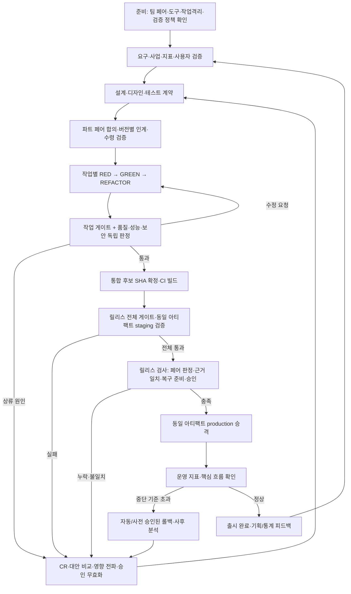

# 바이브코딩 팀 설계 내부 검토

> 후속 반영: [정책 선택 및 1·2단계 보완 기록](../decisions/2026-10-07-review-remediation.md). 아래 발견 사항과 수치는 기준 커밋 당시의 검토 결과이며, 현재 수정 완료 범위는 후속 기록을 따른다.

- 검토일: 2026-10-07
- 기준 커밋: `d5f4915120c65a19f57c2f6ca456d4b1323c7313`
- 검토자: Codex. 실제 Claude 멤버와의 합동 리뷰·페어 승인은 수행하지 않았다.
- 범위: README, 조직 결정 기록, 19개 역할 파일, 7개 팀 설정, 템플릿, 구성·소통·게이트 실행 도구, 기존 테스트 및 추가 재현 검사.
- 검토 결과: **조직과 협업 절차는 목표에 대체로 부합한다. 전체 검증 통과를 강제하는 실행 제어가 부족하므로, 현재 상태만으로 배포 조건을 보장할 수 없다.**
- 이 보고서는 보완 설계안이다. 기존 역할·팀 설정·실행 코드는 변경하지 않았다.

## 1. 요청별 판정

| 요청 | 판정 | 확인 결과 |
|---|---|---|
| SW 개발에 필요한 파트와 역량 정의 | 대체로 충족 | 요청한 18개 파트에 진행을 더한 19개 역할 파일에 역량·책임·입력·산출물·완료 기준이 있다. 운영 신뢰성·데이터 관리·실사용자 검증·문서의 책임은 여러 파트에 흩어져 있다. |
| 각 파트 최소 2명, Codex와 Claude 구성 | 현재 프로필 충족 / 자동 강제 미충족 | 등록된 모든 역할에 Claude 1명·Codex 1명이 있다. 다만 한 명뿐인 팀과 같은 엔진 2명인 팀도 구성 검사에 통과했다. |
| 서로의 스킬·역량에 기반한 최선의 합의 | 절차 충족 / 실효성 보완 | 독립 초안·반증·2회 교환·이견 상정은 정의되어 있다. 실제 도구 사용 가능성과 결과 검증 능력의 점검, 산출물 변경 시 승인 무효화가 필요하다. |
| 파트 간 인계와 더 나은 대안 탐색 | 문서 충족 / 실행 보완 | 인계 패킷·수령 검증·CR·합동 리뷰·영향 전파가 있다. 수령·합의·차단 상태와 의존성은 문서·메시지로 관리하며 자동 검사는 없다. |
| 테스트·성능·보안·품질 반복 검증 | 기본 실행 충족 / 판정 결함 | 게이트 실행·실패 기록·반복 실패 경고가 있다. 0개 실행 PASS, 파이프라인 실패 은폐, 부분 실행 PASS와 이력 혼용을 재현했다. |
| 모든 검증 통과 후 배포 | 미충족 | 배포 전 확인은 역할 지시로 존재하지만 이를 검사하는 릴리스 실행기가 없다. 커밋·설정·아티팩트·승인·검증 결과를 하나로 묶어 검사해야 한다. |

‘완벽하게 통과’는 **승인된 요구와 검증 기준을 빠짐없이 적용하고 모두 통과한 상태**로 운영 정의를 두는 것이 적절하다. 유한한 테스트나 두 모델의 합의가 모든 미발견 결함의 부재를 증명하지는 않는다. 이 한계를 이유로 게이트를 낮추지는 않는다.

## 2. 현재 구성의 실제 확인

`역할파일` 열을 `+`로 분해해 각 파트의 엔진별 담당자를 검사했다. `@substitute`는 호출 대상의 대체 지정이므로 역할 파일을 주입받은 정식 담당 인원과 구분했다.

| 팀 | 실제 멤버 | Claude : Codex | 역할 파일로 배정된 파트 | 파트별 페어 | 겸임 |
|---|---:|---|---:|---|---|
| discovery | 10 | 5 : 5 | 5 | 전부 충족 | 구현·검증·배포 담당을 갖춘 개발 팀은 아님 |
| web-service | 28 | 14 : 14 | 16 | 전부 충족 | 빌드+CI, CD+배포 |
| mobile-app | 28 | 14 : 14 | 16 | 전부 충족 | 빌드+CI, CD+배포 |
| game | 32 | 16 : 16 | 19 | 전부 충족 | 비즈니스분석+통계, 빌드+CI, CD+배포 |
| backend-api | 24 | 12 : 12 | 15 | 전부 충족 | 기획+비즈니스분석, 빌드+CI, CD+배포 |
| tool-lib | 16 | 8 : 8 | 14 | 전부 충족 | 기획+비즈니스분석, 코어개발+개발구현, 품질+보안, 빌드+CI+CD+배포 |
| full | 38 | 19 : 19 | 19 | 전부 충족 | 없음 |

한 페어가 여러 파트를 맡더라도 각 파트에는 두 사람이 배정되어 있으므로 요청의 최소 인원 조건은 충족한다. 다만 **파트마다 전담 2명을 요구한다면 겸임 프로필은 그 조건을 충족하지 않는다.** 본 검토에서는 전담 여부보다 책임·교차 검증의 유지 여부를 기준으로 판단했다.

유지할 장점은 다음과 같다.

- 모든 파트에 양쪽 모델의 역할과 서로 다른 검토 관점을 명시했다.
- 생성 파트와 검증 파트의 주도 엔진을 나누고, 같은 산출물을 작성한 사람이 자신을 반증하지 못하게 했다.
- 수령 파트의 반려·대안 제시·상류 CR과 영향 전파가 정의되어 있다.
- 인수 조건에서 테스트·구현까지 요구 ID로 추적하는 구조가 있다.
- 반복 실패 시 원인 분석·상류 변경·사용자 결정으로 올라가는 탈출 경로가 있다.
- 테스트 약화 금지, 운영 배포 승인, 롤백 검증, 출시 후 피드백까지 고려했다.

근거: `roles/_team-workflow.md:96`, `:160`, `:195`, `:213`, `:269` 및 각 `teams/*.conf`.

## 3. 파트별 권장 책임 구성

현재 19개 파트는 유지할 수 있다. 아래는 기존 책임을 바탕으로 양쪽 멤버의 주책임과 인계 경계를 명확하게 정리한 구성안이다. 각 행은 **해당 파트의 Claude 멤버와 Codex 멤버 최소 2명**을 전제로 한다.

| 파트 | Claude 주책임 | Codex 주책임 | 핵심 산출물 → 수령 파트 |
|---|---|---|---|
| 진행 | 분해·위임·사용자 소통·의존성 관리 | 상태·서명·근거·절차 감사 | 보드·결정 요청 → 전 파트 |
| 기획 | 문제·가치·범위·스토리 작성 | 근거·범위·반례·인수 가능성 검토 | PRD·US/AC → 비즈니스분석·통계·설계·디자인·테스트설계 |
| 비즈니스분석 | 시장·수익·이해관계자·NFR 작성 | 수치·가정·정책 리스크 검토 | 사업성·NFR·추적표 → 기획·설계·보안·테스트설계 |
| 통계 | 지표·실험·측정 계획 | 통계적 타당성·편향·데이터 품질 검증 | 지표·이벤트·실험 → 기획·설계·구현·성능·운영 |
| 시스템설계 | 구조·계약·ADR·작업 경계 | 장애·일관성·확장·비용·대안 검토 | ADR·계약 → 코어·구현·테스트·보안·성능·빌드·CD |
| 디자인 | 흐름·화면·상태·디자인 시스템 | 접근성·일관성·구현 가능성 검증 | 화면·토큰·a11y → 구현·아트·테스트·품질 |
| 테스트설계 | AC를 테스트로 변환·검증 정책 작성 | 거짓 통과·RED 원인·검증 누락 확인 | TC·테스트 코드·게이트 → 제작·검증·CI |
| 코어개발 | 도메인·엔진·공통 모듈·단위 테스트 | 불변식·경계·동시성·인터페이스 검토 | 코어 모듈 → 구현·품질·성능·보안 |
| 개발구현 | UI·API·연동·계측·결함 수정 | 요구 누락·오류 경로·단순성 검토 | 기능·테스트·PR → 품질·성능·보안·디자인 |
| 아트 | 시각 방향·에셋 제작 | 일관성·규격·예산·권리 검토 | 스타일·에셋·명세 → 배경·구현·빌드 |
| 배경 | 환경·공간·레벨 제작 | 동선·가독성·규격·예산 검토 | 장면·맵·환경 에셋 → 구현·테스트·성능 |
| 사운드 | 효과음·음악·큐·믹싱 | 정보 대체·음량·규격·권리 검토 | 음원·큐·오디오 명세 → 구현·테스트·빌드 |
| 품질 | Codex 판정의 오탐·누락·유지보수성 검증 | 독립 결함 판정·회귀·커버리지 검사 | 판정·결함 목록 → 제작 또는 릴리스 |
| 성능 | 측정 조건·해석·병목 검증 | 예산·부하·분포·회귀 판정 | 예산·측정·판정 → 설계·제작·CI·운영 |
| 보안 | 위협·위험도·대응·판정 검증 | 위협 모델·공격 경로·스캔·검증 판정 | 보안 요구·판정 → 설계·테스트·제작·CI/CD |
| 빌드 | 재현 가능한 빌드·패키징·에셋 변환 | 의존성·무결성·체크섬 검증 | 빌드 스크립트·아티팩트 → CI·CD |
| CI | 변경마다 자동 검사·빠른 피드백 | 게이트 동등성·우회 방지·필수 검사 검증 | CI 근거·동일 아티팩트 → CD·릴리스 |
| CD | 환경·승격·마이그레이션 자동화 | 승격 조건·권한·부분 실패·롤백 검증 | 환경·승격·복구 기록 → 배포·운영 |
| 배포 | 릴리스 계획·실행·결과 보고 | 출시 근거·호환·중단 기준 검증 | 릴리스·배포 기록 → 운영·통계·기획·진행 |

Claude 작성 / Codex 반증을 기본값으로 유지하되, 실제 제작 도구·스킬·프로젝트 경험이 더 적합한 쪽이 주도하도록 산출물 단위로 바꿀 수 있어야 한다. 작성자와 검증자의 분리, 양쪽의 근거 제출은 유지한다. 모델 차이는 교차 검증의 수단이며 합의의 근거는 측정·재현·요구 충족 여부다.

### 추가할 책임과 멤버

새 명칭의 인원을 무조건 늘리기보다 먼저 아래 책임을 정식 파트로 정의하고, 규모에 따라 전담 페어 또는 적절한 기존 페어에 배정하는 방식을 권고한다. 겸임 시에도 역할 파일·산출물·완료 기준을 양쪽에 동일하게 주입한다.

| 추가 파트 | 필요성·적용 조건 | Claude / Codex 책임 | 산출물·인계 | 소규모 겸임 후보 |
|---|---|---|---|---|
| 운영·신뢰성(SRE) | 서비스 개발의 우선 보완. 현재 CD·배포에 분산된 상시 운영의 책임자를 정한다. | 운영·관측·사고 대응 설계 / SLO·장애·복구·용량 검증 | SLI/SLO·알림·백업/복구 실험·RTO/RPO·운영 인수 → 설계·CD·배포·품질 | CD+배포 페어. 운영 검증은 품질·성능도 참여 |
| 데이터관리 | DB·개인정보·이벤트 파이프라인이 있으면 정식 배정. 통계 분석과 데이터 저장·이전 책임은 다르다. | 스키마·이전·데이터 수명·품질 구현 / 무결성·호환·복구·삭제 검증 | 데이터 계약·마이그레이션·백필·정합성/복구 결과 → 설계·구현·통계·보안·CD | 설계 페어가 정의, 코어가 구현. 품질이 독립 검증 |
| 사용자검증(UX 리서치) | 사용자 대상 제품에 배정. 두 모델의 추정만으로 사용성·재미를 확정하지 않게 한다. | 리서치·과업·플레이테스트 설계 / 표본·편향·관찰·대안 검증 | 검증 가능한 가설·실사용자 관찰·수정 권고 → 기획·디자인·테스트·품질 | 기획+디자인과 겸임, 통계 검토. 실제 사용자 입력을 모델이 꾸며 내지 않는다. |
| 문서·개발자경험(DX) | API·SDK·도구에서는 우선, 서비스에는 사용자·운영 문서 책임을 배정한다. | 시작 가이드·API 예제·사용자/운영 문서 / 예제 실행·버전 일치·설치 경험 검증 | 실행 가능한 예제·문서·호환/지원 정책 → 구현·테스트·빌드·배포 | 도구는 기획+코어, 서비스는 기획+배포. 구현 결과와 교차 검수 |

네 파트를 모두 전담으로 추가하는 참조 구성은 **23개 파트·46명(Claude 23 / Codex 23)**이다. 이는 역할 카탈로그의 상한 예시이며, 실제 프로젝트에서 46개 세션을 상시 가동할 필요는 없다. 활성 작업과 검증 페어를 단계별로 운영하되 검증 인원을 작성자에게 흡수하지 않는다.

제품에 따라 별도 페어를 추가할 후보는 AI/ML·모델평가(모델 기능과 평가 데이터가 핵심인 경우), 기술아트·애니메이션(복잡한 게임 제작), 지역화·콘텐츠(다국어·대량 콘텐츠)다. 근거 없이 모든 팀에 추가하지 않는다.

## 4. 실행·운영 설계의 주요 결함

우선순위의 P0는 이 팀 도구가 목표로 하는 ‘전체 통과 후 배포’를 신뢰하기 전에 해결할 항목이고, P1은 안정적인 프로젝트 운영 전에 보완할 항목이다. 제품 취약점의 심각도 등급과는 다르다.

### R01 · P0 — 검사하지 않거나 실패했는데 PASS가 나올 수 있다

- `--only ','`는 설정된 게이트가 모두 실패하도록 되어 있어도 **0개 실행 / PASS / exit 0**이다. 빈 선택 목록 검증이 없고 실패 수가 0이면 통과로 판정한다.
- `security | 보안 | false | cat`은 검사 역할의 앞 명령이 실패해도 **PASS / exit 0**이다. 게이트 명령을 `bash -c`로 실행하며 그 내부 셸에는 `pipefail`을 켜지 않는다.
- 보완: 선택 게이트 수가 0이면 설정 오류로 종료하고, 명령 셸의 파이프라인 실패를 전파한다. 검사 명령 자체도 실제 발견·누락·불가 판정을 올바른 종료 코드로 반환하는지 확인한다.
- 근거: `bin/team-gate:55`, `:61`, `:90`, `:105`. 재현 이름 `zero-selection`, `pipeline-masks-failure`.

### R02 · P0 — 부분 통과·필수 검사 누락이 전체 통과와 구분되지 않는다

- unit 성공 / security 실패 설정에서 `--only unit`은 **PASS**를 기록하고 `latest.md`를 덮어쓴다. 부분 실행 기능 자체는 유용하지만 릴리스 근거로 사용할 수 없는 결과라는 표시가 필요하다.
- unit 하나만 등록해도 PASS다. 실행기에 테스트·품질·성능·보안의 필수 정책 검사나 적용 제외 승인 검사는 없다.
- 보완: 결과를 `PARTIAL_PASS`와 `FULL_PASS`로 구분하고 설정된 목록·실행 목록·미실행 목록을 저장한다. 프로젝트 정책에 필수 검사와 승인된 적용 제외 사유를 두고 릴리스는 필수 검사 전체 통과만 받는다.
- 근거: `bin/team-gate:105`, `:128`, `templates/gates.conf`. 재현 이름 `partial-pass`, `missing-required-categories`.

### R03 · P0 — 검증·리뷰·배포 대상의 일치를 강제하는 릴리스 검사가 없다

- 현재 기록에는 짧은 HEAD와 미커밋 변경 여부만 있다. 같은 HEAD라도 코드·설정·테스트가 다르거나 작업 중 바뀔 수 있다. 변경 내용을 식별하는 해시는 없다.
- 품질·성능·보안 서명과 배포 전 근거 확인은 문서 규칙이다. 이를 실제 배포 실행의 선행 조건으로 검사하는 도구는 없다. 일반 `team-gate`는 페어 판정을 검사하지 않는다.
- 로컬 비커밋 경로만 PR에 적으면 다른 worktree·CI·다른 컴퓨터에서 근거를 읽지 못할 수 있다.
- 보완: CI의 확정된 소스 SHA, 게이트 정책 해시, 테스트/환경 정보, run ID, 아티팩트 digest, 각 파트의 양쪽 판정, 승인된 릴리스 계획을 묶는다. 릴리스 검사기와 CD 승격 조건이 같은 묶음을 검사하고, 누락·불일치·오래된 판정은 차단한다. 보존은 Git 커밋을 강제하기보다 접근 가능한 CI 아티팩트 등으로 해결할 수 있다.
- 근거: `bin/team-gate:77`, `roles/_team-workflow.md:248`, `:269`, `:303`, `roles/배포.md`의 출시 전 확인. 현재 저장소에는 릴리스 검사기나 실제 프로젝트 CI/CD 워크플로가 없다.

### R04 · P1 — 최소 인원·엔진 다양성·실제 역할 배정이 강제되지 않는다

- 한 명만 있는 기획 팀, Claude 2명만 있는 기획 팀 모두 `setup-team -n`에서 exit 0이다. 로더는 형식·엔진 값·중복·별칭을 검사하지만 파트별 페어를 검사하지 않는다.
- 정체 블록의 상대 찾기는 역할 문자열 전체의 일치에 의존한다. `A+B`와 `A`처럼 겹치는 배정에서 파트별 상대를 정확히 표시하지 못한다.
- `@substitute`는 호출 대체표이고 역할 파일을 추가 주입하지 않는다. 예를 들어 tool-lib 통계 대체자는 `기획+비즈니스분석`만 받는다. 실제 통계 책임을 맡기려면 이 배정만으로는 불충분하다.
- 일부 `@duty`는 Claude 쪽에만 추가되어 같은 페어의 Codex가 프로젝트별 변경 책임을 같은 수준으로 전달받지 못한다.
- 보완: 역할을 파트별로 분해하여 서로 다른 멤버 최소 2명·양쪽 엔진·겸임 범위를 검사한다. ‘호출 대체’와 ‘실제 책임 겸임’을 분리하고, 실제 겸임은 양쪽 역할 주입과 별칭까지 검사한다. 프로젝트별 책임은 페어 양쪽에 적용한다.
- 근거: `lib/members.sh:27`, `setup-team.sh:88`, `:237`, 각 설정의 `@substitute`·`@duty`. 재현 이름 `single-member`, `same-engine`.

### R05 · P1 — 모든 PR에 전체 인수 테스트 통과를 요구하면 점진적 개발이 막힐 수 있다

테스트설계는 모든 MVP AC의 RED 테스트를 먼저 준비하고, 코어·구현은 전 게이트 통과 후에만 리뷰를 요청한다. 이 규칙을 제품 전체에 문자 그대로 적용하면 초기 코어 PR도 아직 구현하지 않은 모든 기능의 인수 테스트 때문에 리뷰·머지를 못 할 수 있다. 이는 실제 제품으로 검증한 장애가 아니라 문서의 범위 정의에서 도출한 운영 위험이다.

보완: 작업별로 승인된 요구·테스트 범위와 기존 회귀 검사를 정하고 작업 완료를 판정한다. 미구현 AC는 ‘작업 범위 밖의 미완료 요구’로 추적하고 테스트 삭제·skip으로 숨기지 않는다. 제품 릴리스에서는 전체 승인 범위의 인수·비기능·회귀 검사를 예외 없이 요구한다. **작업 통과는 제품 릴리스 통과가 아니다.**

근거: `roles/테스트설계.md`의 완료 기준, `roles/코어개발.md`의 그린 루프, `roles/개발구현.md`의 Don't, `roles/_team-workflow.md:217`.

### R06 · P1 — 단계 순서보다 앞서 필요한 책임의 착수 조건이 불명확하다

성능·보안은 S4로 분류되지만 S1/S2에서 예산·위협 모델·이벤트 검토를 제공해야 한다. 빌드·CI도 최초 PR 전에 준비되어야 한다. 공통 단계 게이트를 순차 착수로 해석하면 선행 단계가 후행 파트의 검토를 기다리는 충돌이 생긴다. discovery에서는 통계의 이벤트 검토에 필요한 보안 역할을 시스템설계로 대체하지만 역할 파일은 주입하지 않는다.

보완: 단계는 산출물 성숙도이고 파트의 근무 시작 시점이 아님을 명시한다. 보안·성능·운영·빌드·CI의 초기 준비를 S1/S2부터 허용한다. discovery의 완료 기준은 컨셉·측정 가능성·위험 식별로 제한하고, production 수준 데이터 수집 승인은 정식 보안·데이터 검토 이후로 둔다.

근거: `roles/_team-workflow.md:67`, `roles/통계.md`·`roles/시스템설계.md`의 완료 기준, `teams/discovery.conf`.

### R07 · P1 — 변경된 산출물에 대한 합의·인계·판정의 재검증 규칙이 필요하다

현재 서명은 이름·날짜·이견의 텍스트이고, 산출물 변경 후 기존 서명을 무효화하는 규칙과 자동 검사는 없다. 인계 패킷은 버전을 기록하지만 재수령·연쇄 판정 무효화는 명확하게 강제되지 않는다. ‘남은 이견’이 있는 서명이 인계 가능한지와 차단 이견의 기준도 명시할 필요가 있다.

보완: 산출물 ID·버전/해시·작성 세션·검증 세션·반례·합의안을 기록한다. 변경 시 그 버전의 승인과 하류 판정을 `STALE`로 바꾸고 영향 재검토 후 재승인한다. 차단 이견이 있으면 `BLOCKED`; 합의 실패는 측정·프로토타입·합동 리뷰를 거쳐 사용자에게 올린다. 작성자와 검증자가 동일하거나 양쪽 엔진의 근거가 빠지면 승인 불가다.

근거: `roles/_team-workflow.md:110`, `:117`, `:181`, `:190`, `templates/handoff.md`, `templates/review.md`.

### R08 · P1 — 메시지 제출과 업무 수령·완료는 별개다

`team-send`는 입력창 상태·큐 표시를 확인해 메시지 제출을 판단한다. 받는 페어가 해당 버전을 수령 검증했다거나 작업을 마쳤다는 뜻은 아니다. 수령 기록·응답 없는 위임 관리는 진행 파트의 문서 운영에 의존한다.

보완: 메시지/인계 ID와 상태를 `SENT → ACKED → ACCEPTED/REJECTED → DONE`으로 나누고 양쪽의 응답을 기록한다. 기한·재시도·중복 처리 규칙을 두며, 전송 성공 표시만으로 수령 또는 완료로 바꾸지 않는다. 공유 보드·추적표·라이선스 기록은 단일 편집 담당 또는 변경 요청 방식으로 갱신한다.

근거: `bin/team-send:195`, `:227`, `roles/진행.md`, `templates/board.md`.

### R09 · P1 — 반복 실패 이력이 부분 실행과 섞이고 실행이 무기한 멈출 수 있다

- security 실패 2회 → unit만 성공 1회 → security 실패 1회로 실행하면 security를 실제 세 번째 실패시켜도 연속 실패 경고가 없다. 실행하지 않은 검사의 실패 이력을 PASS 회차가 초기화한다.
- 값 없이 `--only`를 주면 옵션 파싱이 반복되어 0.5초 제한 재현에서 종료되지 않았다. 게이트 명령 자체에 대한 실행 시간 제한도 없다.
- 보완: 게이트별 실제 실행 이력과 제품 전체 검증 회차를 분리하고 미실행은 성공으로 처리하지 않는다. 옵션 값·빈 목록을 검증하고 제한시간·취소·실행 오류를 명시적인 실패/불완전 결과로 기록한다. 3회·5회 경고는 자동 개선의 근거이지 자동 통과 권한이 아니다.
- 근거: `bin/team-gate:17`, `:90`, `:110`, `:117`. 재현 이름 `partial-resets-streak`, `missing-option-value`.

### R10 · P1 — 역할 주입 생성 시 명령 치환 오류가 숨겨진다

7개 프로필 드라이런은 exit 0이나 각 멤버마다 `CI-클로드: command not found`가 발생했다. 정체 블록의 heredoc에서 예시 이름을 감싼 백틱이 셸 명령 치환으로 실행되기 때문이다. 해당 예시는 주입 문서에서 빠지고 생성 성공으로 표시된다.

보완: 문서용 백틱을 안전하게 출력하고 주입 생성 실패를 상위 실행에 전파한다. 드라이런의 종료 코드뿐 아니라 stderr·역할 포함·상대 페어·프로젝트 책임을 검사한다.

근거: `setup-team.sh:103`의 heredoc, `:114`, `:237`, `:357`. 증거 JSON의 프로필별 `dry_run_stderr`.

### R11 · P1 — 역량 선언과 실제 실행 가능성, 실행 권한을 구분해야 한다

역할 파일의 ‘요구 역량’과 플러그인 이름은 실제 수행 가능성의 증명이 아니다. 플러그인 미설치 시 경고 후 기동하고, 이 검토의 드라이런에서는 경고가 없었지만 인증·도구 기능·모바일 기기·음원 제작/청취 능력까지 검증한 것은 아니다. `full`의 아트·배경·사운드는 필요한 제작 도구를 프로젝트에서 별도로 정해야 한다.

또한 현재 기동 명령은 양쪽 CLI의 승인 우회를 기본으로 사용하고 Codex의 샌드박스도 우회한다. worktree는 브랜치·인덱스 분리이며 권한 격리가 아니다. 저장소에 커밋이 없으면 worktree 없이 전원이 공유 폴더로 기동한다.

보완: 파트별로 스킬·버전·입출력·사용 가능한 도구·인증 상태·작은 실행 결과를 준비 확인에 기록한다. 필수 도구 미작동은 차단한다. 역할에 맞는 작업·리뷰·배포 권한을 구분하고, 운영 배포는 별도 승격 경로로만 실행한다. 코드 제작 팀은 worktree 준비 실패 시 공유 폴더로 자동 강등하지 않는다.

근거: `teams/README.md`의 플러그인 정책, `setup-team.sh:137`, `:144`, `:287`, `:327`, `roles/_team-workflow.md:29`.

### R12 · P1 — 검증 기준 변경과 허용 결함 정책을 목표와 일치시켜야 한다

공통 §6.5는 테스트설계와 담당 파트의 합의·기록으로 기준 하향을 허용하고 품질은 MEDIUM을 후속 작업으로 등록해 통과시킬 수 있다. 정당한 요구 변경이나 오탐 수정도 필요하지만, 검사 실패를 없애려는 기준 변경과 구분해야 한다.

보완: 최초 승인된 릴리스 정책을 고정하고 기준 완화는 사유·영향·재검증·기존 정책 대비 차이를 기록한다. 범위·보안 위험·출시 품질 변경은 사용자 결정으로 올린다. 엄격한 릴리스에서는 차단 결함 0건과 전체 필수 게이트 통과를 요구한다. 후속 작업으로 넘길 수 있는 등급·조건은 사전에 정하고, 남은 결함을 숨긴 ‘완벽’ 보고는 하지 않는다.

근거: `roles/_team-workflow.md:248`, `:263`, `roles/품질.md`의 판정 기준, `roles/보안.md`의 위험 수용.

## 5. 목표에 맞는 인계·검증·배포 구조

보안·성능·운영은 요구·설계부터 참여한다. 빌드·CI는 첫 구현 PR 전까지 기본 실행 경로를 준비한다. 인계와 작업 착수는 필요한 입력이 수령된 단위에서 진행하며, 모든 파트의 전체 단계 종료만 기다리는 방식으로 묶지 않는다.

### 인계 계약에 추가할 필드

`handoff_id`, 요구 ID, 산출물 버전/해시, 발신 파트의 양쪽 근거·판정, 수신 파트별 양쪽 수령 결과, 의존 산출물 버전, 차단 질문/CR, 기한, 상태, 영향 전파 대상, 후속 책임자를 기록한다. 상태 전이는 진행 파트가 감사할 수 있는 형태로 관리한다.

수신 파트가 더 나은 안을 찾으면 반례·측정·대안·비용을 CR로 제안하고, 발신 페어가 수용·대안·거절 근거를 반환한다. 합의된 변경은 새 버전으로 재인계하고 관련 테스트·구현·검증 판정도 갱신한다. 단순 재전송으로 합의가 성립했다고 처리하지 않는다.

### 배포 가능 조건

아래 조건을 모두 만족할 때만 릴리스 검사기가 배포 가능을 반환하도록 설계한다.

1. 팀의 필수 파트에 서로 다른 Codex·Claude 담당과 유효한 역량·도구 준비 결과가 있다.
2. 승인된 릴리스 범위의 요구→설계→테스트→구현 추적이 완전하고, 차단 CR·이견·결함이 0건이다.
3. 확정된 후보 SHA에서 고정된 필수 게이트를 모두 실행해 FULL_PASS를 얻었다. 미실행·시간 초과·취소·결과 누락은 통과가 아니다.
4. 해당 SHA·정책에 대한 테스트설계 및 품질·성능·보안의 양쪽 판정이 유효하다. UI 제품이면 디자인·사용자 검증, 상태 저장 서비스이면 데이터·복구 검증도 포함한다.
5. CI가 만든 아티팩트 digest와 staging에서 검증한 digest가 같고 production도 그 아티팩트를 승격한다. 환경별 재빌드로 대체하지 않는다.
6. 마이그레이션·구버전 호환·스모크·롤백/복구·관측성 검증이 통과하고 중단 기준이 수치로 정의되어 있다.
7. 운영 릴리스 승인 기록이 그 릴리스 계획과 연결되어 있다. 기존 사용자 승인이 범위·조건까지 포함하면 재승인을 반복 요구하지 않는다.

배포 후 검증을 통과해야 ‘출시 완료’로 보고한다. 지표 악화 시 롤백·복구와 원인 분석 결과를 다음 개발 루프에 반영한다.

## 6. 보완 순서와 검증 기준

| 순서 | 담당 페어 | 보완 작업 | 완료 증거 |
|---|---|---|---|
| 1 | 테스트설계 + CI | R01/R02: 0개·부분 실행·누락·파이프 실패 판정 수정 | 재현 사례가 전체 PASS로 기록되지 않고 릴리스에서 차단됨 |
| 2 | 진행 + 시스템설계 | R04/R10: 팀 페어 검증·역할 주입·대체/겸임·양쪽 책임 수정 | 단독·동일 엔진 설정 거부, 7개 프로필 stderr 오류 없음, 주입 내용 검사 |
| 3 | 테스트설계 + 진행 | R05/R06/R09/R12: 작업/릴리스 범위·조기 참여·이력·기준 변경 정리 | 작은 기능 단위가 개발 가능하며 미완료 제품의 릴리스는 거부됨 |
| 4 | CI + CD + 배포 + 검증 파트 | R03/R07: 근거 묶음·버전별 판정·릴리스 검사기 | SHA·정책·digest·서명 누락/불일치/변경 사례 모두 거부됨 |
| 5 | 진행 + 각 파트 | R08/R11: 수령 상태·도구 준비·실행 권한·새 역할 배정 | 전송/수령/완료 구분, 필수 도구 실패 차단, 두 멤버의 역할 일치 |
| 6 | 개발구현 + 전 검증·전달 파트 | 작은 서비스로 전 구간 파일럿 | 상류 CR 1회 이상, 게이트 실패 수정, 판정 갱신, staging·승격·롤백까지 실행 근거 |

이 보완은 팀을 교체하는 작업보다 현재의 좋은 원칙을 실행 도구가 지키도록 만드는 작업에 가깝다. 실제 팀 구성은 제품별로 필요한 책임을 고르고, 겸임 여부를 명시한 뒤 페어 검사로 확인해야 한다.

## 7. 수행한 검증과 한계

| 검사 | 결과 |
|---|---|
| `bash tests/team-gate.sh` | 14개 통과 / 0개 실패 |
| `bash tests/team-tools.sh` | 격리된 임시 tmux 서버에서 23개 통과 / 0개 실패 |
| 7개 프로필 역할별 인원·엔진 검사 | 등록 역할의 모든 페어 충족 |
| 7개 프로필 `setup-team -n` | 모두 exit 0. 모든 프로필에서 멤버 수만큼 heredoc 명령 치환 오류 발생 |
| 단독 멤버·동일 엔진 팀 재현 | 모두 exit 0으로 승인되어 페어 검증 누락 확인 |
| 0개 실행·파이프라인 실패·부분 성공·필수 범주 누락 | 모두 PASS / exit 0 재현 |
| 옵션 값 누락 | 0.5초 제한에서 미종료. 정적 코드로 옵션 파싱 반복 확인 |
| 부분 실행을 섞은 실패 반복 | 실제 security 검사 3회 실패에도 마지막 회차의 연속 실패 경고 없음 |

첫 team-tools 실행은 샌드박스의 tmux 소켓 생성 제한으로 실패했다. 허용된 격리 테스트 실행으로 재검증한 23개 결과를 최종 결과로 사용했으며, 실제 팀 세션이나 기본 tmux 서버는 조작하지 않았다.

원시 검사 근거: [2026-10-07-team-design-evidence.json](2026-10-07-team-design-evidence.json). 여기에는 프로필별 배정·드라이런 stderr와 추가 재현의 설정·명령 옵션·종료 코드·판정·이력이 있다.

기존 테스트는 구현된 기본 기능을 검증하므로 통과 결과가 이번 목표의 완전 충족을 뜻하지 않는다. 특히 부분 실행 PASS는 기존 테스트가 현재 동작으로 기대하는 결과다.

실제 28~38개 Claude/Codex CLI 동시 기동, 모델 접속·플러그인 실행, 실제 서비스의 CI/CD·production 배포·사운드/기기 검수는 수행하지 않았다. 따라서 운영 성능·사용 한도·최종 제품 품질에 대한 합동 승인은 이 보고서의 검증 범위 밖이다. 이번 검토에서 생성한 프로필 주입 파일은 기존 정책에 따라 무시되는 `roles/.merged/audit-20261007-*`에 있으며 Git 변경에는 포함되지 않는다.
